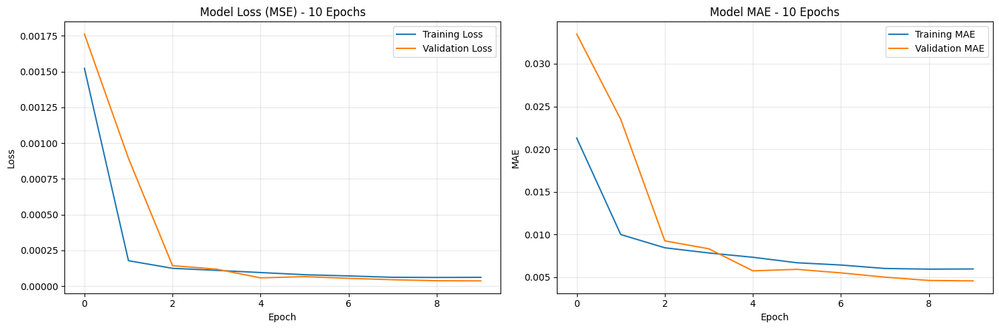
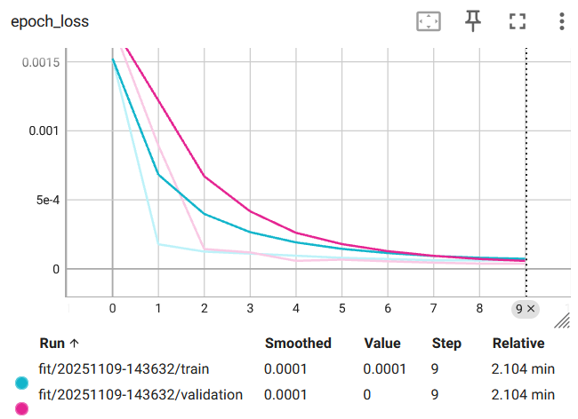
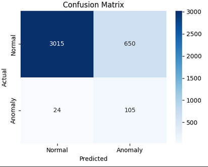
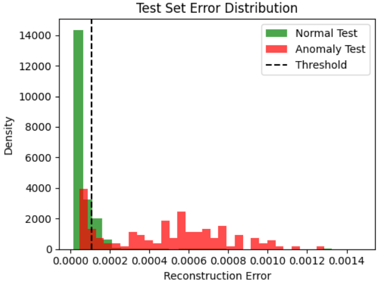
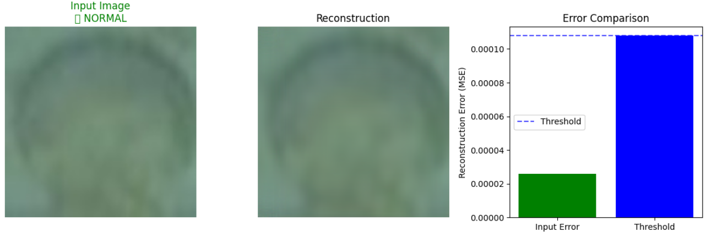

# Детекция аномалий

## 📋 Обзор проекта

Промышленная система обнаружения аномалий, которая выявляет утечки металла в процессе производства баллонов с использованием автоэнкодеров с глубоким обучением. Модель обучается исключительно на изображениях, полученных в процессе нормальной эксплуатации, и обнаруживает аномалии посредством анализа ошибок реконструкции.


## 🎯 Постановка проблемы

При производстве металлических баллонов разливы происходят из-за недостаточного застывания стенок, что приводит к утечке расплавленного металла. Данная система автоматически обнаруживает такие аномалии с высокой точностью, используя компьютерное зрение и глубокое обучение.

## 🏗️ Архитектура модели

### Convolutional Autoencoder
```
Input (128, 128, 3)
│
├── Encoder
│   ├── Conv2D(32) → BatchNorm → MaxPool
│   ├── Conv2D(64) → BatchNorm → MaxPool
│   └── Conv2D(128) → BatchNorm → MaxPool
│
├── Bottleneck
│   └── Conv2D(256) → BatchNorm
│
└── Decoder
    ├── Conv2DTranspose(128) → BatchNorm → UpSample
    ├── Conv2DTranspose(64) → BatchNorm → UpSample
    └── Conv2DTranspose(32) → BatchNorm → UpSample
    │
    └── Output: Conv2D(3, activation='sigmoid')

```
## 📊 Структура набора данных
```
dataset/
├── train/ # Normal images (training)
├── proliv/ # Anomaly images (threshold optimization)
└── test/
├── imgs/ # Test images
└── test_annotation.txt # Ground truth labels
```

---
##  Конфигурация обучения

- Epochs: 10
- Batch Size: 32
- Learning Rate: 0.001
- Optimizer: Adam
- Loss Function: Mean Squared Error (MSE)
- Validation Split: 0.2

# Model Loss






# Стратегия обнаружения аномалий

Система использует пороговое значение ошибки реконструкции:

reconstruction_error = mse(original, reconstructed) 
is_anomaly = reconstruction_error > threshold

### Результаты эксперимента

| Метрика | Значение |
|--------:|:------|
| Final Test Accuracy | 0.8224 |
| Optimal threshold  | 0.000108 |
| TPR (Anomaly Detection) | 0.8140 |
| TNR (Normal Detection) | 0.8226 |







## Образец



---
## Требования
Установка зависимостей:
pip install -r requirements.txt


