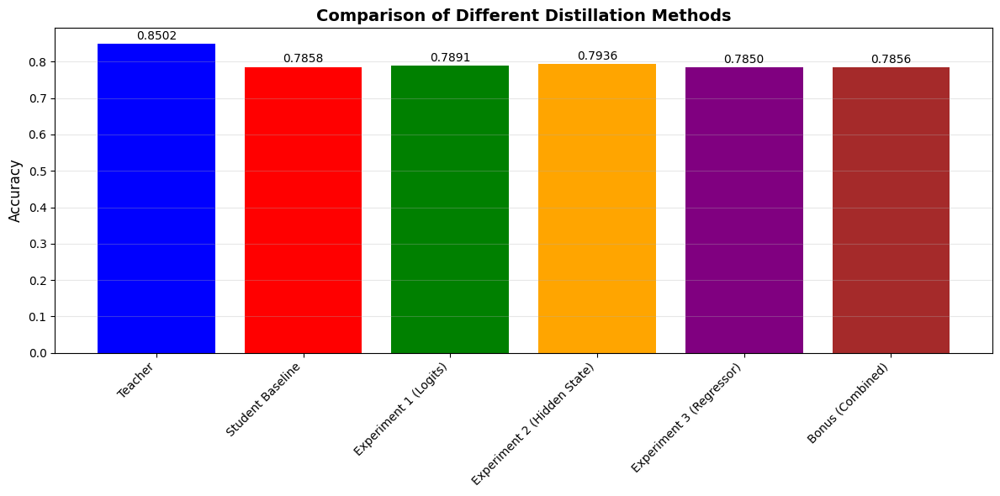

# Different Types of Distillation

Комплексная реализация и сравнение различных методов извлечения знаний на основе набора данных CIFAR-10.

## 📋 Обзор проекта

В этом проекте исследуются различные методы извлечения знаний, при которых большая модель учителя переносит знания в меньшую модель ученика. Мы реализуем и сравниваем четыре различных подхода к извлечению знаний с комплексным анализом метрик и визуализацией TensorBoard.

## 🎯 Цели

- Внедрить и сравнить различные методы извлечения знаний
- Проанализировать эффективность каждого метода с помощью метрик и визуализации
- Понять, как передача знаний улучшает эффективность студенческих моделей
- Предоставить воспроизводимую экспериментальную основу для исследования извлечения знаний

## 🏗️ Структура проекта


```
distillation-project/
│
├── models/
│   ├── teacher_net.py    # Large teacher model architecture
│   ├── student_net.py    # Small student model architecture
│   └── student_regressor.py  # Student with feature regressor
│
├── experiments/
│   ├── experiment1_logits_distillation.py
│   ├── experiment2_hidden_state_distillation.py
│   ├── experiment3_regressor_distillation.py
│   └── bonus_combined_distillation.py
│
├── utils/
│   ├── data_loader.py
│   ├── loss_functions.py
│   └── metrics.py
│
├── runs/                 # TensorBoard logs
```

## 🧪 Эксперименты

### 1. Логит-дистилляция
- **Описание**: Прямой перенос знаний с использованием смягченных выходных вероятностей
- **Ключевые характеристики**: Температурное масштабирование, потеря KL-дивергенции
- **Функция потерь**: Комбинированные мягкие цели (логиты учителя) и жесткие цели (истинные данные)

### 2. Скрытая дистилляция
- **Описание**: Сопоставление промежуточных представлений признаков
- **Ключевые характеристики**: Косинусная потеря сходства между признаками учителя и ученика
- **Функция потерь**: Комбинация логит-потерь и косинусной потери признаков

### 3. Дистилляция на основе регрессоров
- **Описание**: Использование обучаемых регрессоров для сопоставления измерений признаков
- **Ключевые характеристики**: Сверточные регрессоры 1x1, потеря MSE для признаков
- **Функция потерь**: Комбинированная логит-потеря и регрессия признаков потери

### 4. Комбинированная дистилляция (бонус)
- **Описание**: Гибридный подход, сочетающий несколько методов дистилляции
- **Ключевые особенности**: Множественные компоненты потерь, имитация характеристик
- **Функция потерь**: Взвешенная комбинация логарифмических, косинусных и среднеквадратических потерь

## 📊 Экспериментальные результаты

| Method | Accuracy | Parameters | Improvement |
|--------|----------|------------|-------------|
| Teacher Model | 85.02% | ~3.5M | - |
| Student Baseline | 78.58% | ~0.5M | Baseline |
| Logits Distillation | 78.91% | ~0.5M | +0.42% |
| Hidden State Distillation | 79.36% | ~0.5M | **+0.99%** |
| Regressor Distillation | 78.50% | ~0.6M | -0.10% |
| Combined Distillation | 78.56% | ~0.5M | -0.03% |



## 🔑 Основные результаты

- **Дистилляция скрытых состояний показала наилучшие результаты** с улучшением на 0,99% по сравнению с исходным уровнем
- **Логитная дистилляция** показала умеренное улучшение (+0,42%)
- **Методы, основанные на признаках** (регрессор и комбинированный метод), показали небольшое снижение производительности
- **Модель учителя** достигла точности 85,02%, что обеспечило сильный контроль

## 📈 Анализ эффективности

### Лучший метод: Hidden State Distillation

Метод **Hidden State Distillation** достиг наибольшего улучшения (+0,99%) благодаря:

- использованию косинусной потери сходства между промежуточными признаками;
- сопоставлению направлений признаков, а не точных значений;
- сохранению реляционной информации между образцами.

## 🚀 Быстрый старт

### Установка

```bash
# Clone the repository
git clone https://github.com/Jubaer78/different-types-distillation.git
cd different-types-distillation
```

# Требования
pip install -r requirements.txt

