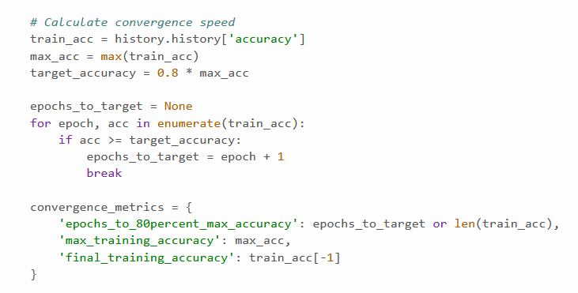

# Self-Supervised Learning на наборе данных CIFAR-10

## Обзор проекта

В этом проекте исследуются методы обучения с самоконтролем (SSL) на наборе данных CIFAR-10, сравнивая предварительно обученные с помощью SSL модели с контролируемыми базовыми значениями в различных режимах обработки данных.

---

### Описание задания

Основанный на домашнем задании , этот проект реализует самоконтролируемое обучение с использованием следующей экспериментальной установки:

- **Базовый уровень**: Повторите домашнее задание 1, используя N% маркированных выборок (N = 100, 50, 10).
- **Подход SSL**:
  - Предварительно обучите экстрактор признаков на всем наборе данных, используя самообучение без меток.
  - Используйте предварительно обученный экстрактор признаков в архитектуре сети для обучения на N% маркированных выборок.
  - Сравните производительность с базовыми моделями.
   
### Dataset
- **CIFAR-10**: 60,000 32x32 цветных изображений размером 32x32, разделенных на 10 классов
- Training set: 50,000 изображений
- Test set: 10,000 изображений

### Архитектура
- Экстрактор признаков предварительно обучен с использованием самообучения
- Одинаковая архитектура для SSL и базовой линии для объективного сравнения
- Оценка по стандартным метрикам классификации

### Конфигурация обучения
- Различные режимы данных: 100%, 50%, 10% размеченных данных
- Согласованные гиперпараметры между экспериментами
- Ранняя остановка на основе критериев сходимости

### Параметры анализа

- Модели сходимости потерь при обучении
- Изменение метрик в процессе обучения
- Скорость сходимости (периоды до плато)
- Максимально достигнутые метрики производительности

## Экспериментальные результаты

### Сравнение показателей эффективности

| Experiment | Accuracy | Precision | Recall | F1-Score | Convergence Epochs |
|------------|----------|-----------|--------|-----------|-------------------|
| **SSL N=100%** | 0.3958 | 0.3893 | 0.3958 | 0.3871 | 1 |
| **Baseline N=100%** | 0.7135 | 0.7226 | 0.7135 | 0.7066 | 3 |
| **SSL N=50%** | 0.3654 | 0.3648 | 0.3654 | 0.3602 | 2 |
| **Baseline N=50%** | 0.6682 | 0.6801 | 0.6682 | 0.6566 | 4 |
| **SSL N=10%** | 0.3434 | 0.3366 | 0.3434 | 0.3376 | 3 |
| **Baseline N=10%** | 0.5065 | 0.5118 | 0.5065 | 0.4900 | 6 |

### Сводка производительности

| Model | Best Accuracy | Best Precision | Best Recall | Best F1-Score | Data Regime |
|-------|---------------|----------------|-------------|---------------|-------------|
| **SSL** | 0.3958 | 0.3893 | 0.3958 | 0.3871 | N=100% |
| **Baseline** | 0.7135 | 0.7226 | 0.7135 | 0.7066 | N=100% |

## Ключевые выводы

### Convergence Анализ:
Все модели обучались в течение 10 эпох. Метрика **Convergence** указывает **номер эпохи, в которой каждая модель достигала максимальной точности валидации** и начинала выходить на плато.

**Определение сходимости:**
- Convergence = Epochs, в которой впервые была достигнута максимальная производительность.
- Модели продолжали обучение до 10-й epochs, но перестали улучшаться после эпохи сходимости.
- Более низкие значения сходимости указывают на более быструю оптимизацию.

**Ключевые выводы:**
- Модели SSL достигают пиковой производительности **раньше** (Epochs 1-3), чем базовые модели (Epochs 3-6).
- SSL демонстрирует более быструю оптимизацию, но более низкую итоговую производительность.
- Базовые модели продолжают совершенствоваться в течение большего количества эпох, достигая более высокой итоговой точности.
 

### Анализ производительности

ОБЩИЙ АНАЛИЗ УЛУЧШЕНИЙ:
- N=100%: SSL -0.3177 (-44.5%) улучшение
- N=50%: SSL -0.3028 (-45.3%) улучшение
- N=10%: SSL -0.1631 (-32.2%) улучшение

## Визуализация экспериментальных результатов

| **SSL Improvements** | **Accuracy (SSL vs Baseline)** |
|---------------------------|---------------------|
|  |  |

| **Speed Comparison** | **Epoch Accuracy** |
|-------------------------|------------------|
|  |  |

| **Learning Rate** | **Epoch Loss** |
|---------------------------|---------------------|
|  |  |

### Наблюдения о компромиссах
- **Скорость против точности**: SSL обеспечивает более быструю сходимость, но более низкую итоговую точность
- **Эффективность использования данных**: Разрыв в производительности сокращается в условиях крайне малого объёма данных (N=10%)
- **Оптимальный вариант использования**: SSL может быть предпочтительнее, когда время обучения критически важно, а средняя точность приемлема

## Заключение

Эксперименты показывают, что обучение с самоконтролем обеспечивает значительные преимущества в скорости сходимости, но при этом снижается итоговая точность модели. Подход SSL особенно перспективен в условиях малого объёма данных, где разрыв в производительности минимален по сравнению с преимуществами в сходимости.

---

## Требования
Установка зависимостей:
- pip install -r requirements.txt
